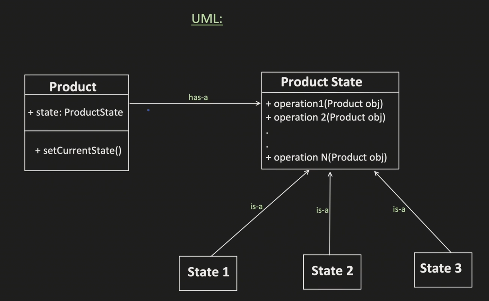

# Design Patterns:

- [Details](#details)
- [Creational Design Patterns](#creational-design-patterns)
    - [Factory Method](#factory-method)
    - [Abstract Factory](#abstract-factory)
    - [Builder](#builder)
- [Behavioural Design Pattern](#behavioural-patterns)
    - [Strategy Method](#strategy-pattern)
    - [Observer Pattern](#observer-pattern)
    - [Decorator Pattern](#decorator-pattern)
    - [Null Object Design Pattern](#null-object-design-pattern)
    - [State Design Pattern](#state-design-pattern)
- [Structural Design Patterns](#structural-design-patterns)
    - [Proxy Design Pattern](#proxy-design-pattern)

## Details:

Design patterns are typical solutions to commonly occurring problems in software design. They are like pre-made blueprints that you can customize to solve a recurring design problem in your code.

The pattern is not a specific piece of code, but a general concept for solving a particular problem.

**Classificaiton of Patterns:**

The most basic and low-level patterns are often called `idioms`. They usually apply only to a single programming language.

The most universal and high-level patterns are `architectural patterns`. Developers can implement these patterns in virtually any language. Unlike other patterns, they can be used to design the architecture of an entire application.

Three main groups of patterns:
1. **Creational patterns** provide object creation mechanisms that increase flexibility and reuse of existing code.
2. **Structural patterns** explain how to assemble objects and classes into larger structures, while keeping these structures flexible and efficient.
3. **Behavioral patterns** take care of effective communication and the assignment of responsibilities between objects.

## Creational Design Patterns:

List of Creational Design Patterns: Factory, Abstract Factory, Builder, Prototype and Singleton.

### Factory Method:

[Code](./Creational_Patterns/Factory_Pattern/VehicleFactoryPattern.java)

Provides an interface for creating objects in a superclass, but allows subclasses to alter the type of objects that will be created.
- In simple term, Factory Pattern provides a method to create objects without exposing the creation logic to the client.

**Core Idea:** Object creation is centralized and hidden.

**Key Components**
1. `Product` (Interface/Abstract Class) – Defines the type of object that will be created.
2. `Concrete Product` (Classes that Implement Product) – The actual classes that will be instantiated.
3. `Factory` (Creates Concrete Product) – Decides which object to instantiate based on input conditions.

**When to use?**
- Use the Factory Method when you don’t know beforehand the exact types and dependencies of the objects your code should work with.

**Why Factory Pattern is powerful?**
- Loose coupling
- Single Responsibility Principle
- Easy to manage object creation
- Cleaner client code

**Examples:**
- Calendar.getInstance()
- LoggerFactory.getLogger()
- Database connection pools
- Object creation in frameworks (Spring beans)
- Parsing libraries

`**Important:**` [Simple Factory](./Creational_Patterns/Factory_Pattern/CarFactoryPattern.java) vs [Factory Method](./Creational_Patterns/Factory_Pattern/VehicleFactoryPattern.java)

**Factory Method:** Define an interface for creating an object, but let subclasses decide which class to instantiate.
- Creation is delegated to subclasses.

Factory method resolves Single Responsibility priciple issue which was being violated in the Simple Factory pattern.

### Abstract Factory:

[Code](./Creational_Patterns/Abstract_Factory/AbstractFactory.java) [[3](#references)]

`Abstract Factory` is a creational design pattern that lets you produce families of related objects without specifying their concrete classes.
- Its a higher-level pattern that internally uses either Simple Factory or Factory Method to create families of objects.
    - Simple Factory / Factory Method → how to create ONE object
    - Abstract Factory → how to create a SET of related objects

Factory Method creates one product, Abstract Factory creates a family of products.
- Its like having multiple factories where each factory produces a complete family of products that work together.

Abstract Factory can be implemented either using a Simple Factory approach with conditionals, or more commonly using Factory Method, where each concrete factory represents a product family and each creation method is a factory method. This allows the system to remain open for extension and closed for modification.

**Key Components;**
1. `Abstract Factory` (Interface for Factories) – Declares methods for creating product families.
2. `Concrete Factories` (Implement Abstract Factory) – Create specific families of products.
3. `Abstract Product` (Interface for Objects) – Declares methods for different product types.
4. `Concrete Products` (Implement Abstract Product) – Actual implementations of products.
5. `Client` (Uses the Factory) – Uses abstract interfaces, does not depend on specific classes.

**When to Use?**
- When you need to create multiple families of related objects.
- When you want to ensure that objects from different families are used together.
- When the system should be independent of how objects are created and composed.

### Builder:

[Computer Builder](./Creational_Patterns/Builder_Pattern/Computer_Builder/ClientCode.java) | [Car Builder - Important](./Creational_Patterns/Builder_Pattern/Car_Production/Demo.java) | [Student Builder](./Creational_Patterns/Builder_Pattern/Student_Builder/Client.java)

**Builder** is a creational design pattern that lets you construct complex objects <ins>step by step</ins>.

The pattern allows you to produce different types and representations of an object using the same construction code.

Create House Object example - Simple solution without applying Builder pattern [[4](#references)]. 

The Builder pattern suggests that you extract the object construction code out of its own class and move it to separate objects called builders.

**Using Builder Pattern:** The pattern organizes object construction into a set of steps (buildWalls, buildDoor, etc.). To create an object, you execute a series of these steps on a builder object. The important part is that `you don’t need to call all of the steps`. You can call only those steps that are necessary for producing a particular configuration of an object.

Some of the construction steps might require different implementation when you need to build various representations of the product. For example, walls of a cabin may be built of wood, but the castle walls must be built with stone.

**Director:** You can go further and extract a series of calls to the builder steps you use to construct a product into a separate class called director. The `director class` defines the order in which to execute the building steps, while the builder provides the implementation for those steps. 

Having Builder class in the code is not strictly necessary. You can always call the building steps in a specific order directly from the client code.

**Another Example:** Think of it like ordering a custom burger: You don’t just get a generic burger; you choose the bun, patty, cheese, and toppings one by one.

**Key Components:**
- **Product** (The Complex Object) → The object that needs to be built.
- **Builder** (Interface/Abstract Class) → Defines the steps for building the object.
- **Concrete Builder** (Implements Builder) → Implements the step-by-step object construction.
- **Director** (Optional, Orchestrates Construction) → Guides the building process (e.g., predefined configurations).
- **Client** (Uses the Builder to Create Objects) → Uses the builder to construct the object as needed.

## Behavioural Patterns:

### Strategy Pattern:

Strategy = Same goal, different ways, swappable at runtime.

Examples:
- Paying for an order: Credit Card, UPI, Net Banking

### Observer Pattern:

Observer = One changes, many react.

**Push:** Subject pushes data to observers

**Pull:** Subject only notifies → Observer pulls data

Most LLD interviews prefer Pull model
- Pull model is preferred when observers need different views of data and we want loose coupling.

Examples:
- Notification systems, Stock Price updates, Subsciption Technologies

### Decorator Pattern:

Decorator Pattern lets you add new behavior to an object dynamically by wrapping it, without modifying its original class.

Decorators and the original object share the same interface.

Decorator = wrap an object to add behavior.

Examples:

### Chain of Responsibility

[Code](./Behavioural_Patterns/Chain_of_Responsibility/Logger/LoggerMain.java)

Chain of Responsibility pattern is a behavioural pattern that passes request along a chain of handlers. Each handler decides **`either to process the request or to pass it to the next handler`** in the chain.
- We can add/remove handlers from the chain

Contains Abstract Handler and then the concrete handlers implementing the functionalilty.
- Since we need to pass the request to another handler which is of same type, `Handler has an object of itself`.

**Example:** 
- Logger in an application. Logger levels: DEBUG Logs, INFO logs, ERROR logs - End of chain.
- ATM Machine: 500 Rs note, 200 note, 100 note, 50 note, 20 note, 10 note - End of chain

### Null Object Design Pattern

Null Object pattern is a behavioural design pattern that uses Polymorphism to eliminate null checks.
- Instead of returning null and adding NULL checks whenever necessary, we return a special object called Null Object that implements the expected interface but does nothing.

## State Design Pattern

The state design pattern allows an object to change its behaviour dynamically at runtime whenever there is a change in its internal state.
- Problems where object change the state after performing some operations can be solved using State Design Pattern.

**UML:**

**Examples:**
- Traffic Signal: States: Red, Green, Yellow [Code](./Behavioural_Patterns/State_Design_Pattern/Traffic_light/TrafficLightMain.java)
- Vending Machine: States: Idle, Accept Coin, Product Selection, change calculation, etc.

## Structural Design Patterns

### Proxy Design Pattern

[Code](./Structural_Patterns/Proxy_Design_Pattern/EmployeeMain.java)

It provides a representative or place holder for another object (real object) to control the access over it.
- Client -> Proxy -> Real Object

**Usecase of Proxy:**
- Access Control: Restrict access to sensitive operations based on user permissions
- Pre/Post Processing: Perform additional operations before and/or after the request to actual object

   
## References:

[1] [Design Patterns](https://refactoring.guru/design-patterns)  
[2] [Gitlab Link](https://gitlab.com/shrayansh8/interviewcodingpractise/-/tree/main/src/LowLevelDesign/DesignPatterns/LLDChainResponsibilityDesignPattern) 
[3] [Abstract Factory Code](https://refactoring.guru/design-patterns/abstract-factory/java/example#example-0)  
[4] [Builder](https://refactoring.guru/design-patterns/builder)  

[N] [Algo Master](https://algomaster.io/learn/lld?code=49ad3beb-de9c-4079-8669-fbfe2b6d4cec)