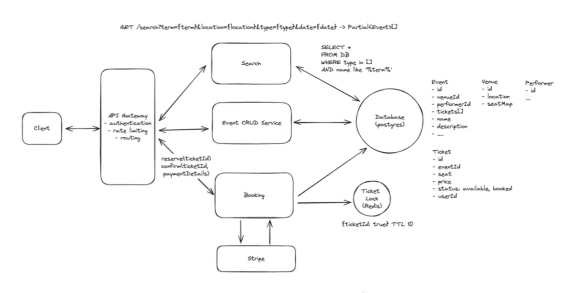

# Ticket Master

TicketMaster is an online platform that allows users to purchase tickets for concerts, sports events, theatre, and other live entertainment

## Functional Requirements

- User should be able to `search events`
- User should be able to `Browse events based on city(location)/date/category`
- User should be able to `view event details` - which can include venue, timing, pricing, description, seating layout
- User should be able to `select seats` for the event
- User should be able to `temporarily reserve selected seats during checkout`
- User should be able to `complete payment` for the selected seat(s)
- User should get `booking confirmation post successful payment`
- User should `receive E-Ticket` (QR Code) whenever needed
- User should be able to `view their booked tickets (History)`

## Non-Functional Requirements

```md
**Tips:**

- Check CAP Theorem, Read-Write Ratio, Query Access Pattern
- Additional:
  - Scale estimates (DAU/QPS/storage growth)
  - Latency requirements (p50/p99 expectations)
  - Throughput requirements (peak RPS/events per second)
  - Fault tolerance / resiliency
  - Durability requirements, Scalability strategy (horizontal vs vertical / independent service scaling)
  - Security requirements (auth/authz, encryption, PII/payment compliance)
  - Rate limiting / abuse protection, Idempotency / duplicate request handling, Ordering guarantees (if applicable)
  - Observability (logging/metrics/tracing/alerting), Disaster recovery (backup, RPO/RTO, multi-region failover)
```

- `Strong consistency for booking tickets & High availability for search and viewing system`
  - In a monolithic application its hard to achieve Consistency and Availability together, but in MS architecture, one component can emphasis on C and other might emphasis on A (CAP Theorem)
  - General answer: `Consistency >> Availability`, because at the end of it, the system's main focus is booking tickets
- Read >> Write
- Scalability to handle surges from popular events
- System should be able to handle 100M DAU 

Above is the prioratized list, below is something considered out of scope. Discuss this with interviewer if anything needs to be reprioratize anything

- GDPR Compliance (EU's General Data Protection Regulation)
- Fault Tolerance

## Entities

- Event
- User
- Venue
  - Performer (Not an MVP)
- Ticket
- Booking

```
NOTE: We can add attributes here or we can leave it for entities only and discuss attributes in the HLD section
```

## API

GET /events/:eventId -> Event & Venue & Performer & Ticket

GET /search?term={term}&location={location}&type={type}&start={start_date}&end={end_date} -> Event[]

POST /booking/reserve
userId is in header
body: {
  ticketId
}

PUT /booking/confirm
userId is in header
body: {
  "ticketIds": string[],
  "paymentDetails": (stripe)
}

## HLD

Client -> API Gateway
- API Gateway -> Event CRUD Service -> Database
- API Gateway -> Search Service -> (SQL Query) -> Database
- API Gateway -> (reserve(ticketId), confirm(ticketId, paymentDetail)) Booking Service -> Database
  - Booking service -> stripe
  - Stripe -> Booking Service (Response from Stripe not to the same URL, to a call back URL setup in the web hook)

API Gateway:
- Routing
- Authentication
- Rate Limiting

Database:
- Event:
  - ID
  - venueId
  - name
  - description
  - eventSpecificLayoutConfig (optional JSON override)
  - Tickets[]
  - ...
- Venue:
  - id
  - location
  - - defaultLayoutConfig (JSON)
- Performer
  - id
  - ...
- Ticket
  - id
  - eventId
  - seat
  - price
  - status (available, reserved, booked)
    - We can get rid of reserved from DB if we are using [distributed lock like Redis](./Redis_In_TM.md)
  - userId

Note: Stripe doesn't call back to booking service by responding to the same request,
- Stripe handles payments asynchronously and sends response via a webhook that we have setup
  - We need to register a call back URL and we'll have some endpoints in our booking service

### How to incorporate the 10 minute window expiry feature when user stays in payment page for more than 10 minutes

- We can store a new attribute in the ticket table -> reservedTimestamp
  - Available seats query will be -> fetch all the available seats and the seats that are reserved but reservedTimestamp is more than 10 minutes ago
    - Cron Job: Runs every 10 minutes and queries the database for everyticket thats in reserved status and check reservedTimestamp, if more than 10 minutes ago, set the status again to available

The above approach still has delta issue, cron job ran at 12:09pm but a ticket should have been available at 12:01pm then delta of 8 minutes

- Use a distributed lock - We can get rid of the reservedTimestamp, reserved status attributes
  - Ticket Lock ([Redis](./Redis_In_TM.md)), contains ticketId and TTL



Event: id, venueId, performerId, tickets[], name, description,...
Venue: id, location, seatMap
Performer: id
Ticket: id, eventId, seat, price, status (Available, Booked), userId

## Deep Dives

https://www.hellointerview.com/learn/system-design/in-a-hurry/delivery#deep-dives-10-minutes