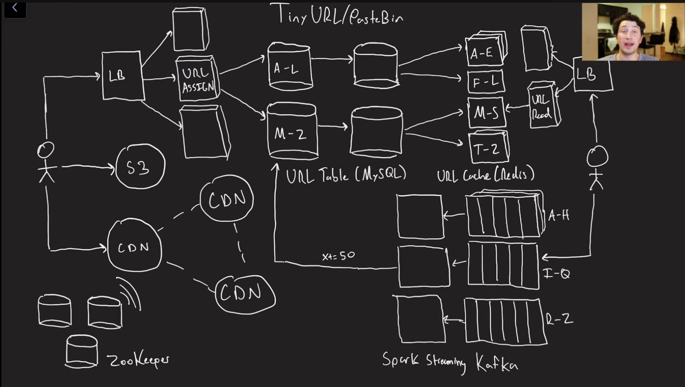

# TinyURL and PasteBin


## Functional Requirements

### Core (MVP)
- Users should be able to `create a shortened URL` for a given long URL.
- Users should be `redirected to the corresponding original URL` when accessing a valid shortened URL.
- Each shortened URL should `uniquely map to one destination URL` at a given time.
  - At a given time is added to allow the user to update the corresponding long url if needed

### Optional / Extended Features
- Users may provide a `custom alias` instead of an auto-generated short URL.
- Users may `set an expiration time (TTL)`, after which the shortened URL becomes invalid.
- Users should be able to `view analytics for their shortened URLs` (e.g., click count, access metadata).
- Users should be able to `deactivate or delete` their own shortened URLs.

### If Authentication is Supported
- Authenticated users should only be able to manage URLs they own.

## Technical Requirements

- The system should be `Low Latency` on redirects (~200ms)
- `Scale to support` 100M DAU and 1B URLs
- Ensure uniqueness of short code
- High Availability, eventual consistency for url shortening
  - In a distributed system (We mostly create a distributed system - Horizontally scale server), Partition Tolerance is a must, so decision comes down to Consistency vs Availability. (2 from `CAP Theorem`)

BOTE (Back Of The Envelope) Estimation:
- Scal, Latency, Storage
  - Doing this up front maybe useless. We can notify the guide to take this for discussion on High Level Design section

<br>

- Read traffic (URL redirection) will be significantly higher than write traffic (URL creation).
- URL redirection should have very low latency.
- Service should be highly available.
- System should scale horizontally to support large traffic and storage growth.
- Short URL mappings should be durable and survive failures.
- Generated short URLs must be globally unique.
- Traffic may be highly skewed, with some URLs receiving significantly more traffic than average.
- Newly created short URLs should be immediately resolvable (read-after-write consistency).
- Analytics data can be eventually consistent.
- Analytics click events should be durably captured.

<br>

- Median URL has 10k clicks, most popular URLs in millions of clicks
- At a time may have to support upto 1 trillion short URLs
- For certain pastes, text sizes can be in the Gigabytes, average size in Kilobyte, 1 trillion * 1 KB = 1 PB
  - Reads >> Writes, want to optimize these

## Core Entities

- Original URL
- Short URL
- User

## API or Interface

Try to `map it with the functional requirements`

```
// Shorten a url
POST /urls -> shortURL
{
  originalURL,
  alias?,
  expirationTime?
}

// Redirection
GET {shortUrl} -> redirect to OriginalUrl
```

## Data Flow

Only applicable to Inftrastrucre heavy design questions like Rate Limiter, Message Queue

## High Level Design

Go through the APIs, draw the system that's necessary in order to satisfy that API

Client -> server -> database

1. POST Request: getShortUrl() -> server creates short url -> stores to database
   1. Returns the short url to client

URL Table in Databse
- shortUrl/customAlias
- longUrl
- userId
- creationTime
- expirationTime

User Table
- userId
- ...

1. GET redirect(short) -> server looks for longUrl for given shortUrl (query in database) -> return the longUrl back to the user with **302 redirect**

302 redirect:
- Its just the HTTP status code which tell the browser I want to take this URL and automatically navigate to it

301 redirect:
- permenant redirect (Client/browsers/DNS-servers can cache this url)
  - In case of 302, requests goes to the server. This is useful in case of us needing to know if the server is working or not, if we need analytics (how many clicks), or if a change in behavior of shortUrl from database

## Deep Dives

Go through each technical requirements and justify how are we going to achieve them

### Link Generation

Random number generator 10^9 1B numbers
- Base62 Encoding, 0-9, A-Z, a-z
  - 62^6 (if n=6) = 56B
- Can use alpha-numeric string -> possibilities = 36^n if we use 0-9, a-z
  - If n=8, we have around 3 Trillion combinations
- Before adding the shortURL to database, we need to check for `collision`

We probably want to Hash (Long URL, user ID, create timestamp)
- md5(longUrl) -> hash -> base62(hash)[:6]
- Chance of collision is same as random number

`Hash Collisions`?
- If 32fz1ca8 is taken try 32fz1ca9 and so on....

#### Can we avoid checking the database?

Yes, using a counter. Is it a better approach - Maybe. 
- Predictibility which is bad for security
    - "Warning, don't shorten private urls"
    - Rate Limiting - to avoid unintentional scraping
  - Bijective Function
    - sqids.org

### Low Latency Redirects

Every read needs to query from database, now we have approx 1B rows, indexing can help us reduce lookup time - Index on shortUrl

We can add a cache to avoid going to the database for lookups (Redis - `Read Through LRU Cache`), key: shortUrl, Value: longUrl

We can further reduce latency using CDNs, but in CDNs we encounter same situation as choices between 301 or 302 redirects
- If we can use a CDN, we can also use a 301 redirect

### Scale Our System to support 100M DAU and 1B URLs

#### Does our primary server even need to scale?

100M DAU -> Average 1-2 redirect -> 100M is 10^8 / 10^5 seconds -> 1000 rps
- 10k-100k rps peak

An average EC2 instance (like a T3 medium) can handle around a 1000 requests at a time - It depends on A. how much computationally expensive these requests are, B. How much memory is being used, how much CPU is being used, how large the payloads are, how much bandwidth is being used

We can do `Vertical Scaling` or `Horizontal Scaling`

Read Requests >> Write Requests 

We can evolve our design to be a `microservice architecture` with 2 seperate service (both of which are going to be scaling horizontally) - Read Service, Write Service
- API Gateway would be the entry point. Its going to determine based on that API endpoint which one of the services does it go to.

Making it a microservice architecture can be an onverkill. Need to decide if its needed or not

In case of horizontal scaling, in most of the modern cloud architecture, its done automatically based on configurations. 
- We can set if the CPU load of one server goes beyond 75%, throw up a new server. And if less than 20% is used take the additional server down
  - Ofcourse there would be a gateway in front of these server(s)

If we scale write server, then instead of local counter (if we are using counter based generation) of each individual servers, we need a `global counter` (Can be in Redis)
- Global counters require additional network calls
  - We can load 1000 counts from global count to server. If server goes down before utilizing all the count, no big deal even if they are lost forever

`Database Scale:` Short Code: 8byte, long code: 100 byte, creation time: 8byte, Alias: 100byte, expiration time: 8byte =~ 500bytes
- 1B rows: 500GB
  - 500GB in modern SSDs world isn't that big
- So storage wise single instance could be enough in our case. Can our database instance handle read throughput? Reads are handled by Cache, so some load is distributed to cache

If needed, we make partition of our database, shard key on shortUrl

### Assigning URLs - Replication

We want to try to maximize our write throughput where possible!

Can we use Multi-Leader/Leaderless partitions? NO
- If we use LWW (Last-Write-Wins), there is a chance of data loss

### Assigning URLs - Cache

Sometimes, we can speed up our writes via the use of write-back-cache
- This can lead to same issue as before

### Assigning URLs - Partitioning

Not only partitioning is very important, if we have a lot of data, it can help us speed up our reads and writes by reducing load on every node!
- Can partition by range of short URLs, they are already hashed so sould be relatively even
  - Allows probing to another hash to stay local to one DB
  - Keep track of consistent hasing ring on coordication service, minimize reshuffling on cluster size change

### Assigning URLs - Single Node

Table attributes: tinyURL (unique), actual_url, user_id, create_time, expire_time, clicks

### Assignint URLs - Predicate Locks

Predicate Query: select * from URLs where tinyURL = "dk45a721";
- Index on tinyURL makes predicate query much faster! (O(logN) vs O(N))
- Using a stored prodcedure can reduce network calls in event of hash collision

### Assigning URLs - Materializing Conflicts

Can pre-populate every possible row in our database so they exist to lock on!
- 2 trillion * 1 byte/char * 8 char = 16TB, not very much

### Assigning URLs - Engine Implementation

We don't need range queries so a Hash index would be super fast,
- But we are storing 1PB of data so probably too expensive for in memory DB

So, if we are limited to On Disk Indices, we are left with two choices, 1. LSM Trees + SS Table (-Reads, +Writes), 2. B-Tree (+Reads, -Writes)

### Assigning URLs - Database Choice

So far we have:
- Single Leader Replication
- Partitioned
- B-Tree based index

Seems easy to just use a Relational DB

### Maximizing Read Speeds

Replication + Multiple Partition to ensure adequate ability to handle load
- Possible to get stale read from replica, could check leader on null result?
  - Need to be careful with this, could accidentally spam leader

### Maximizing Read Speeds - Hot Links

Some links are "hot", get much more traffic than others.
- A caching layer can help mitigate a lot of the load!

Caching layer can be scaled independently of DB!
- Partitioning the cache by shortURL should lead to fewer cache miss

### Maximizing Read Speeds - Populating the Cache

Note: We should not "push" links to the cache in advance in this case, we don't know what will be popular, so how should we populate it?
- Write Back: Can have write conflicts
- Write through: slows down write speeds
- Write around: causes initial cache miss
  - Write around suits the most to our requirement
- LRU eviction policy

### Analytics - Naive Solution

We keep a clikc counter per row, could we just increament it?
- Without any sort of locking, this could be a race condition - Locking or using atomic increament operation per row
  - For super popular links, this is too slow

### Analytics - Stream Processing

Idea: We dump the data some where that doesn't require grabbing locks, and then aggregate them later

Options:
- Database -> Relatively slow
- In memory message broker -> Super fast, not durable
- Log Based Message Broker -> Basically writing to write ahead log, durable (Kafka)

### Analytics - Click Consumer

Options:
- HDFS (Hadoop Distributed File System) + Spark
  - Batch job to aggregate clicks, may be too frequent
- Flink (Stream service)
  - Processes each event individually, may send too many writes to the database depending on implementation
- Spark Streaming
  - Processes events in configurable mini-batch size

Stream processing frameworks enable us to ensure exactly once processing of events via checkpointing/queue offsets!


### Analytics - Excatly Once?

Events are only processed exactly once internall - Think of it like Kafka + Spark Streaming

Now, from spark streaming to Database, it sends write instruction to DB, DB commits and sends the Ack to Spark, but during this time network connection is lost (or spark streaming goes down)

Options:
- Two Phase Commit (Super Slow)
- Idempotency Key, Scales poorly if may publishers for same row

### Analytics - One Publisher Per Row (Short URL)

By partitioning our Kafka queues and Spark streaming consumers by short URL, we can ensure that only one consumer is publishing clicks for a shortID at a time

Benefits:
- Fewer idempotency keus to store
- No need to grab locks on publish step

### Delete Expired Links

Can run a relatively inexpensive batch job every x hour (can be night jobs) to check for expired links
- Only has to grab a lock of row currently being read

## PasteBin

PasteBin is a similar problem as TinyURL, but the difference here is that PasteBin can have a super large paste
<br>


For pastes that are multiple GB, we cannot store them in our DB (Postgre allows 4GB limit for text attribute)
- Could store in an object store or HDFS
- Object store likely preferable, cheaper, no batch jobs to run, don't need data locality
- CDNs will greatly improve latency, if these massive files are infrequent enough a write through model could make sense!
  - Order we could use for write: write to CDN -> (If goes through) -> Write to S3 -> Write to database




