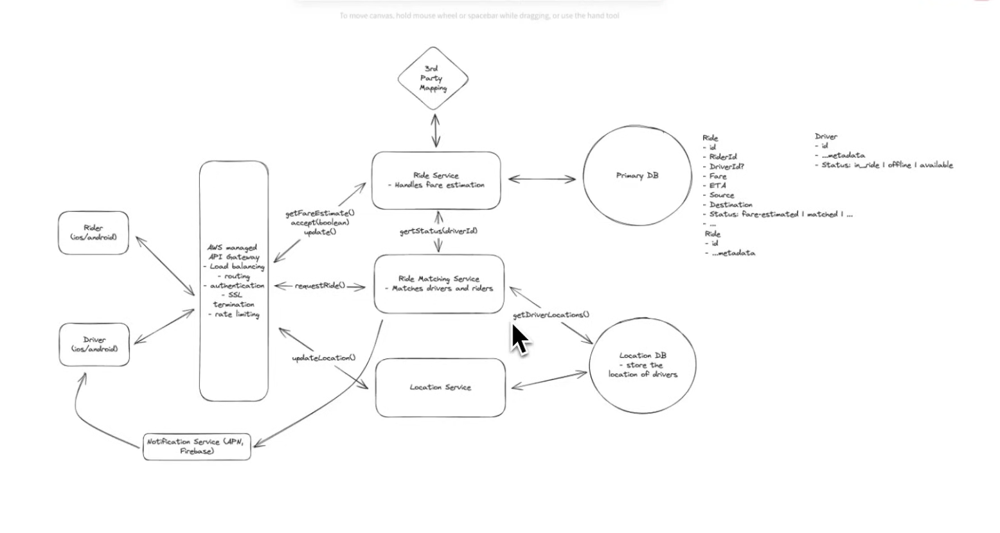

# Uber

## Functional Requirements

- User should be able to `input a start location and an end location, and get an estimate fare`
- User should be able to `request a ride` based on an estimate
- Drivers should be able to `accept/deny request` and `navigate to pickup/dropoff`

Additional Functional Requirements: 

```txt
Mostly focus on the core requirements, worth mentioning the additional requirements but with a note that for now we are excluding them
```

- Should be able to choose the `type of vehicle`
- Should be able to `see the rider`
- Should be able to `cancel the ride`
- `Schedule a ride` in advance
- Ratings for drivers and Riders

## Non-Functional Requirements

- Low Latency matching (< 1 min to match or failure) 
- Consistency of matching. Ride to Driver is 1:1
- Highly Available outside the matching
- Handle High Throughput, surges for peak hours or special events (Hundereds of Thousands of requests within a given region)

Additional Non-Functional Requirement

- Resiliance and Handeling System Failures
- Monitoring, Logging, Alerting, etc.
- CI/CD pipeline\

### Back of the envelope estimations

Discuss with the interviewer that we prefer to do it later on in the HLD section so that we can know if there are any calculations that would directly impact our design

## Core Entities

- Ride
- Driver
- Rider
- Location

## API

POST /ride/fare-estimate -> Parts of the Ride
{
    source,
    destination
}

Why POST on fare-estimate? When getting fare estimate for from-to locations, we would store them in the Ride entity
- We can modify the Ride entity based on user booking the ride or not
- This ride entity data can be used for analytics

PATCH /ride/request -> 200 or 400
{
    rideId
}

Above call would happen Asynchronously

POST /location/update
{
    lat,
    long
}

PATCH /ride/driver/accept
{
    rideId,
    True/False
}

Realistically above should be a POST as it would create a new row with status
- Do we care about drivers denying the request, YES. For analytics to understand behavior of riders, locations, rides, etc.

PATCH /ride/driver/update -> lat/long | null
{
    rideId,
    status: 'pickedup' | 'droppedoff'
}

The returned lat/long is the location of next step, mainly destination if the status is changed to pickedUp


In all the above REST call, whenver we need userId, we will get it from session or the JWT token from the header

## High Level Design

### Flow Diagram

Rider (ios/android) <-> API Gateway 

API Gateway <-getFareEstimate()-> Ride Service

Ride Service <-> 3rd Party Mapping (Google Map)
- To know the current estimate based on traffic and vehicle type between source and destination
- Fare: For now simple distance*fixed_amount_per_km

Ride Service <-> Primary DB

API Gateway <-requestRide()-> Ride Matching Service (RMS)

RMS <-getDriverLocation()-> Location DB
- Get driver location within small radius

Driver (ios/android) <- Periodic Call -> API Gateway <- updateLocation() -> Location Service <--> Location DB

RMS <- getStatus(driverId) -> Ride Service

RMS <- notifyDriver(ride) -> Notification Service <--> Driver

Driver <--> Gateway <- accept(rideId, boolean) -> Ride Service
<--> Update driverId/status(if selected) in Ride table

Driver <--> Gateway <- update(rideId) -> Ride Service <--> Ride table
- Updates the status. Can be driver_reached, picked_up, dropped_off

#### Component Details

**AWS Managed API Gateway:** 
- Routing, Load Balancing, Authentication, SSL Termination, Rate Limiting

**Ride Service:** 
- Handles fare estimation 

**Ride Matching Service:**
- Matches drivers and riders

**Location Service:**
- Updates drivers' location in the location DB
- Each driver periodically calls updateLocation() method, for example 5 seconds

**Notification Service:**
- It will keep notifying the driver for the requests made by the nearby riders
- Apple Push Notification, or Google's notifications

### Databases

#### Primary DB:

Ride: id, source, destination, riderId, driverId?, fare, eta, status: fare_estimated | ..., ....

Rider: id, ...metadata

Driver: id, ...metadata, status (offline/available/in_ridec)

#### Location DB

Stores the location of drivers

### Key Questions

#### How do we get drivers' locations into the location database?

### Additional Notes

Why keep Ride Service and Ride Matching Service seperate?
- Both are doing incredibly different things
- RMS is more computationally expensive and also going to be an asynchronous process
- So by seperating them we allow them to be scale independentely, maintained by seperate teams



## Deep Dives

Satisfy the Non Functional Requirements

Estimation: 
- 5-6M Drivers, 3-4M active drivers
- 3M / 5sec -> 600k TPS (update location by driver)

### Low Latency Matching - Especially for the Driver Location

If we use Postgres for Location DB, and have column for Lat and Long respectively
- Range query to get drivers within the Lat-Long upper-lower bound
- We have four bounds, upper-lower-left-right

This sucks for a few reasons
- The indexes we buil for Lat-Long respectively are B-Tree and they are great for range queries on One Dimmensional Data but this is a 2D data, B-Tree fails here
- If the range increases (say 10km) we have a lot of data to scan through
- Postgres has limitation of 2-4k TPS which is way more off wrt 600k

To lookup `proximity searches` more efficiently, we can use **`GeoSpatial Indexes like QuadTrees`**

Postgres has an extension for geospatial index named **`PostGIS`**

To handle 600k/s request, our only way in this case is to add a queue between Location Service and Location DB
- Batching the requests
- Downside: We introduced significant amount of latency such that the Location DB now going to be mildly inaccurate
  - The Quad Tree index needs to be re-indexed. With all the new data coming in the tree needs to shift around (Expensive and a lot of space in memory)

So, Postgres is an okay answer but not the most efficient

#### Better answer

In order to handle this high TPS, we can make Location DB an in-memory data store (Redis)
- A well optimized Redis can handle 100k-1M TPS
- Redis support **`geohashing`**
  - Easy to calculate, cheap to store, doesn't require any additional DS
  - Even though drivers' distribution of location would be uneven, because of extremly high frequency of writes, it makes GeoHashing the optimal answer

#### QuadTree vs GeoHashing

`QuadTree is great` when we have un-even distribution or uneven density of locations, and we don't have high frequency of updates (Don't want to re-index the tree)

`GeoHashing is` indiscriminate as it pertains to density, less good if uneven distribution of densities of locations, but really good if we have high frequency updates

### Reduce the 600k TPS

We can increase the time between sending location update requests.

More sophisticated answer: Built an algorithm to catch pattern to decide whether we should send location update request or not
- Examples: 
  - Status-Is the driver currently accepting rides or not
  - The speed, are they parked. Have they been parked for 20 minutes? If so, their location isn't changing so there is no need to send updates
  - The proximity to ride requests or hot areas. If they are out at a remote location, maybe don't need to send location updates as frequently


### Consistency of matching

No driver is assigned to more than one ride and no ride has been assigned to more than one driver

Consistency of Matching:
1. We don't send more than one request (to a driver) at a time for a given ride
2. We don't send any driver more than one request at a time

**For point-1**, in the RMS, we get a list of top 10 drivers from the getDriverLocations() method,
- We can iterate through the list sequenctially and notify that driver, wait for some time, if no response move onto next driver
- A single ride that needs matching is only being handled by single instance of the RMS service instances


**For point-2**, the tricky part is Ride-1 goes to RMS-1, Ride-2 goes to RMS-2, how would RMS1 and RMS2 communicate with each other to let other know that they have send their ride request to a particular driver
- Coordination between the N instance to see similar state that a given driver is currently occupied
  - We can introduce a status enum in Driver DB as request_sent. If the status is this, the viewing instance moves onto next driver
    - The issue here is similar to ticket master for the case of handling no double booking of same seat
      - Read that to get more idea on it
  - We can use a distributed lock (Redis)
    - Or we can make Primary DB a DynamoDB and introduce a new table called DriverLock with TTL. DriverLock table: driverId


### High Throughput

With an additional case of Surges for popular events.

Natural solution is to scale RMS service dynamically, but we can't scale them horizontally dynamically quickly enough
- Introduce a queue between Gateway and RMS

API Gateway <-requestRide()-> Ride Request Queue <--> RMS
- Partition of the queue cannot just be FIFO (Round Robin style), if a request that comes first which is in remote location and RMS service is not able to handle it quickly, it can happen that the requests after that in the same queue which are important and can be dealt quickly are sitting ideal in the queue

