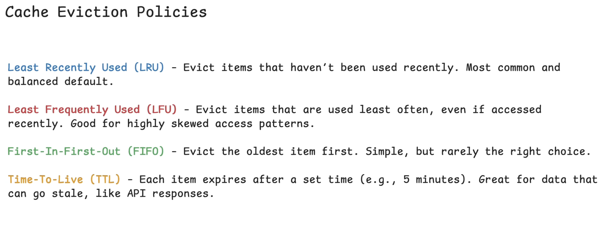

# Caching:

- [Where to cache](#where-to-cache)
- [Architecture](#cache-architectures)
- [Eviction Policies](#cache-eviction-policies)
- [Challanges](#issueschallanges-with-cache)
- [When do we need Cache?](#when-do-we-need-cache)
- [How to introduce Caching?](#how-to-introduce-caching)

A cache is a temporary storage which keeps recently used data handy so that we can get it much faster next time.

## Where to cache?

1. **External Caching:**
    - In case of `cache hit` (If the data is found in cache) then retrieve from cache. In case of `cache miss`, fetch it from DB as fallback.
    - In case of fallback, the retrieved data is stored in the cache.
    - This is usually called `Cache-Aside (Lazy Loading) pattern`.
    - In a scaled system which might have multiple application servers, these `servers can share the same external cache`.

2. **In Process Caching:**
    - No complexity of adding something like Reddis. If application servers have plenty of memory, this can be a good option.
    - Its the fastest kind of caching.
    - Independent caching for each servers.

3. **CDN:**
    - `Geographically distributed network of servers` that can cache contents closer to users.
    - Core goal is Optimization for network latency.
    - Media delivery is the most used case. Modern CDN can do more than storing static data. They can store public API reponses, HTML pages.

4. **Client Side Caching:**
    - Data is stored directly on the user's device in the browser or app.

## Cache Architectures:

It defines how the application interacts with the cache.

`Order in which reads and writes happen between the cache and the database and the application service`.

1. **Cache Aside:**
    - Application checke the cache first.
    - Pros: Only things which users request would be in cache. 
    - Cons: In case of cache miss, read from DB would take more time.

2. **Write-Through:**
    - Application writes directly to the cache first, and the cache synchronously writes that data to the database.
    - Write isn't considered complete unless both the write operations are successful.
    - We need caching library or framework to perform write from cache to DB. It should tigger the DB's write login automatically. Tools like Reddis or Memcached don't natively provide this support.
    - Cons: Write operations are slow, might polute the cache with data which might never be used.

3. **Write-Behind:**
    - Similar to write-thorugh. Difference is cache writes the data into DB asynchronously in the background.

4. **Read-Through:**
    - Similar to cache-aside. Difference is cache handles the DB lookup instead of the application.
    - `CDNs work like this`. In case of miss, it fetched content from the origin server, saves it and provides it to the application.
    - Cons: How to achieve read from DB from cache mechanism.

## Cache Eviction Policies:

## Issues/Challanges with Cache:

Things like uneven load, stale data, unexpected spikes in traffic are some of the key issues present with Cache.

1. **Cache Stampede (Thundering Herd):**
    - This happens when a cache entry expires (eg. TTL), and suddenly a flood of request all trying to rebuild that cache at the same time.
    - Ways to avoid it: 
        - Request Coalescing (Single Flight) -> When multiple requests try to rebuild the same cache key, then `only the first one should work, the rest should wait for the result to come in and read from the cache`.
        - Cache Warming: Instead of waiting for popular keys to expire, we can proactively refresh them just before they expire.

2. **Cache Consistency:**
    - This happens when the `Cache and the DB return different values for the same data`.
    - Most systems read from the Cache and writes in DB. There is a small window (either depends on eviction policy or refresh time), when there is inconsistency between the both.
    - There is no perfect fix to this. Some of the possible ways:
        - Invalidate the cache on write.
        - Use short TTLs.
        - If not necessary, its fine if it return stale data for some time until eviction.

3. **Hot Keys:**
    - Hot keys is a cache entry which gets way more traffic than the rest.
    - A cache key could be receiving millions of requests per second, and `that one key can overload a single Reddis node or shard` eventhough that cache is working as expected.
    - Solutions:
        - Replicate these hot keys. Put the data on multiple shards in the cache cluster. `Application server can load balance evenly accross` the shards/nodes.
        - `Add a local fallback cache`: eg. use an inprocess caching to add cache to application server.

## When do we need cache?

When atleat one of the below is true:
1. Read-heavy workload
    - 100 million active user with avg 20 requests per day -> total ~2 billions request which is more than my DB can handle, lets add cache to take the read load off of the DB.
2. Expensive Queries
    - Something like in the case of news-feed where computing a users personalized news feed can require joining a bunch of posts, followers, likes, all these things across multiple tables, which can be really expensice. Lets cache it for fix TTL.
3. High Database CPU
    - This is based on the performace metrics. Not a generic scenario like the rest. If the databse starts to peg out on its CPU.
4. Latency Requirement
    - Can be included in the non-function requirements that you needed 100 millisecond response time on some API endpoint. If databse queries for these APIs take long, we can add Cache.

## How to introduce Caching?

1. Identify the bottleneck.
2. Decide what to cache. Not everything should be cached.
3. Choose the cache architecture
4. Set an eviction policy
5. Address the downside

## Reference:

- https://www.hellointerview.com/learn/system-design/core-concepts/caching