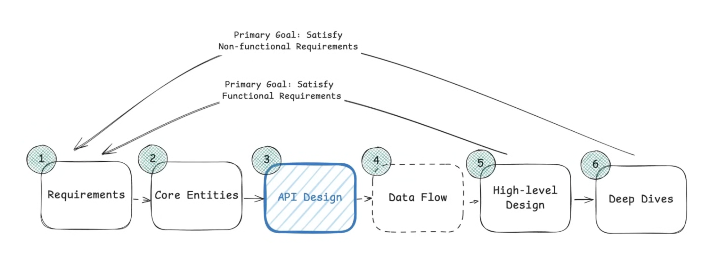

# Basics

- [Caching](./Caching.md)
- [Sharding](./Sharding.md)
- [Data Modeling](./DataModeling.md)
- [API Design](./API_Design.md)
- [Object Storage](./Object_Storage.md)
- [How to prepare for System Design Interview](./How_to_Prepare_for_Interviews.md)

 

- [Additional Topics](./Additional_Topics.md)

 

