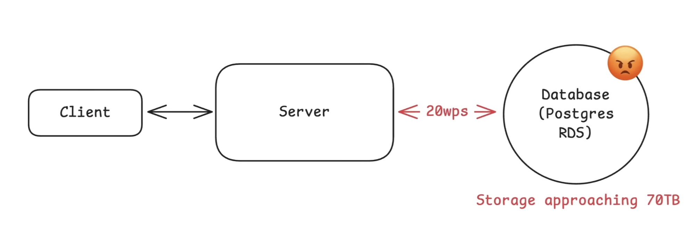

# Sharding

- [Why do we need Sharding](#why-do-we-need-sharding)
- [What is Sharding](#what-is-sharding)
- [How to Shard](#how-to-shard-split-the-data)
    - [Choosing a Shard Key](#choosing-a-shard-key)
    - [How to Distribute Data](#how-to-distribute-data)
- [Interview Discussion](#things-to-discuss-in-interview-for-sharding)
- [Consistent Hashing](#consistent-hashing)

## Why do we need sharding:

If data grows larger and/or request per second (wps - Writes Per Second) increase, we can scale the database vertically. We can also do sharding to solve this issue.

## What is Sharding:

- Sharding is a process of spliting our data accross multiple machines so that no single database holds everything.
- Each shard is its own standalone database with its own CPU, Memory, Connection Pool, Storage.
- It stores just a subset of the data and together the shards form the full database.

## How to shard (split) the data?

1. What to shard by
    - The field that is used to group the data. It is called `Shard Key`. Example: user_id
2. How to distribute data
    - Strategy for mapping the shard key's value to a given machine (databse).
    - Example: Split user_id into ranges or hash them evenly across shards or other way

### Choosing a Shard Key:

**Good Ways:** High Cardinality, Even Distribution, Aligns with queries.
- Social Media App: Sharded with user_id, e-commerce app: Order Database: Shard key is order_id

**Bad Ways:** Low Cardinality, Unevenly Distributed, queries require scatter-gather.
- Shard Keys like isPremium/!isPremium, Columns like creation_date -> created in 2023, 2024, 2025

### How to Distribute Data:

1. Range based shard:
    - user_id: 0-10M, 10M-20M, 20M-30M
    - `Hotspot issue occurs`. If application is new, early shards are used extensively, rest of the shards stay ideal. All the new users entry will go to lastest shard. 
2. Hash Based:
    - Generate the hash_key from user_id. Then hash_key % 3 (If three shards are present)
    - `Issue comes when rebalancing is needed`. When we need to add or remove shards. Will need reshuffling of the data.
    - This is where [consistent hashing](#consistent-hashing) comes in.
3. Directory Based Sharding:
    - Instead of using formula to decide where data lives, directory sharding uses a lookup table.
    - For each record (user_id for example), we store which shard the data belongs to.

## Challanges with Sharding:

1. Hot Spot:
    - Even with good sharding strategy, it can happen that one shard gets more data.
    - In case of user_id base sharding, what if messi and ronaldo's profile details both come in shard-1.
        - shard-1: 1M wps, shard-2: 1k wps, shard-3: 20k wps
    - Possible solution: `Compound shard key`. Instead of using user_id only add additional piece of data/suffix.
    - Other popular solution: Have `a dedicated celebrity shard`.
        - Add a directory to check if id is celebrity. If celebrity, lookup in that dedicated shard or else go on usual method like hash shard method and find the appropriate shard.
2. Cross-Shard operations:
    - Any operations that need information from more than one shard becomes more expensive.
    - It usually happend when the query doesn't align with the shard key.
    - We cannot eliminate cross shard queries completely,
        - First line of defence: `choose a good shard key`.
        - `Caching the results` of the most popular cross shard queries can help reducing cross-shard lookups. We are trading latency with consistency here for the particular time perios that result is in cache.
        - Another option is to `Denormalize the data`.
3. Maintaining Consistency:
    - If we need atomic transaction. Bob send 5$ to Alice. Bob is in Shard-3 and Alice is in Shard-1.
    - Possible Solution: `2-Phasec Commits` (2PC). Getting into lock is one problem with 2PC.
    - Solution: `Saga Pattern`. 

## Things to Discuss in Interview for Sharding

Mention what the Shard Key would be in this database. `Be explicite about this`. What column are we sharding on and why.

**Bring it up in the deep dives when talking about scaling (But justify first):**
- No functional requirement for scaling: Storage, Write throughput, Read throughput
- Example: 500 million user with 5KB of data each -> 2.5TB of data. Single Postgres Instance is going to handle that -> no need to shard.
- If 50k wps in peak time, single instance can struggle. -> Need to shard

`You don't always need to shard`

**In case if Sharding is necessary, what do you say:**
1. Propose a shard key based on access pattern
2. Choose distribution strategy
3. Call out the trade-offs
4. Address how will you handle the growth

## Consistent Hashing:

There are three steps in Consistent Hashing:
1. Create a Hash Ring that has a fixed number of points.
2. Evenly distribute the databases in the Hash Ring.

**How to know the databae number for an Event?**
- Get the hash_key from the event_id.
- Place that hash key in the Hash Ring and start moving forward in the clock wise direction until you hit a database.

- In case of Adding a database, choose a position in the ring for new database,
    - All the entry with hashkey between that position and the database that comes first in anti-clock direction, shift those entries to new database
- In case of Removing the database,
    - All the entries before that databse would be shifted to next database.
    - There is a small problem here, if that happend, the next DB that would have new entries would have way more entries than the other databases present in the ring which are not removed.
    - This issue is solved using `Virtual Nodes`.

**What uses Consistent Hashing?**
- Redis, Cassandra, DynamoDB, Many CDNs

**When to go deep into details in Interview?**
- Designing a single scaled backend component like Distributed Cache, Distributed Database, Distributed Messaging Queue