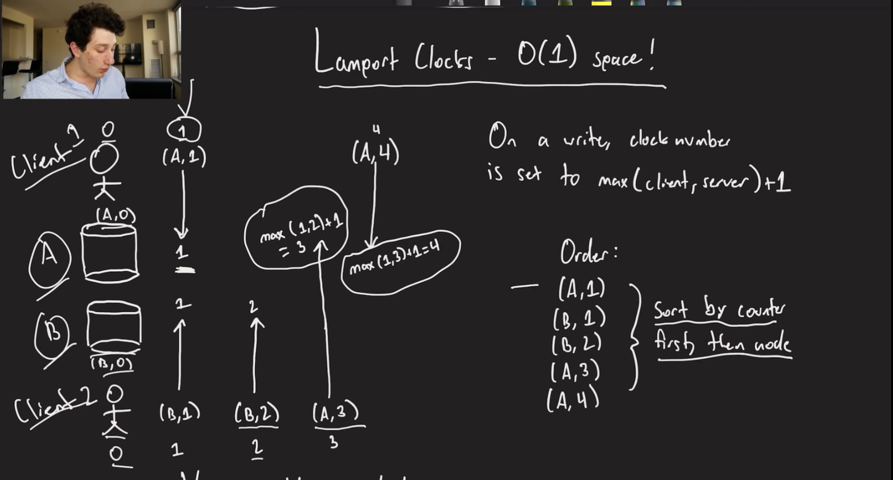
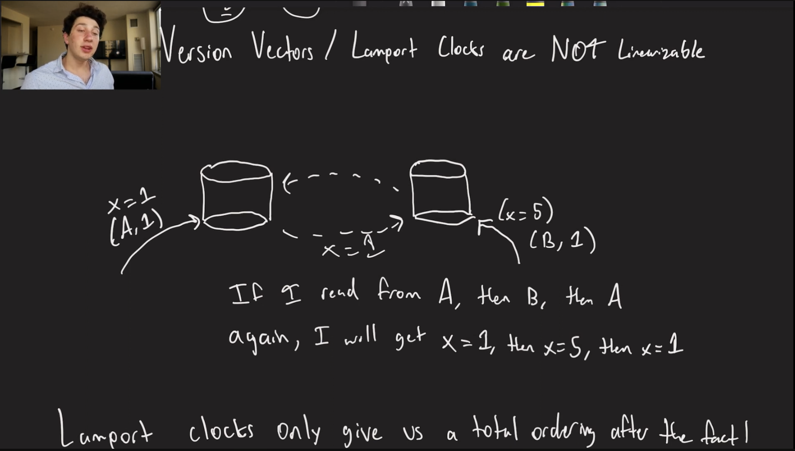

# Partition in Database

1. [Overview](#overview)
2. [Partition Types](#partition-types)
   - [Range Based Partition](#range-based-partition)
   - [Hash Range Based Partition](#hash-range-based-partition)
3. [Secondary Indexes](#secondary-indexes)
   - [Local Secondary Indexes](#local-secondary-indexes)
   - [Global Secondary Index](#global-secondary-index)
4. [Distribute Transactions](#distribute-transactions)
   - [Two Phase Commit](#two-phase-commit)
5. [Consistent Hashing](#consistent-hashing)
6. [Linearizable Databases](#linearizable-databases)
7. [Distributed Consensus](#distributed-consensus)
   - [Raft - Build a Distributed Log](#raft---build-a-distributed-log)
8. [ZooKeeper - Coordination Services](#zookeeper---coordination-services)

## Overview

Splitting the database into multiple partition so that the storage is distributed.
- Some of/All of the partitions can be in different machines

## Partition Types

### Range Based Partition

Assume partition key is on Name. Names starting from A-C are on one partition, D-F on another and so on.

- Pros: Similar keys on same node -> Good for Range Query
- Cons: Hotspot

**Hotspot:** What if there are billion users with name starting from A to B. Only couple of thousand users with name starting from D to E.
- Node with A to B would become hotspot with large data

### Hash Range Based Partition

Use Hashing function on key. Distribute to partition on the value of Hash

- Pros: Relatevly even distribution of the keys
- Cons: No Data Locality for range queries

To solve the range query issue we can use the [`Secondary Indexes`](#secondary-indexes)

## Secondary Indexes

An additional index to our primary index.

Is a second copy of the data effectively where we are sorting it in a different sort order.

### Local Secondary Indexes

Problem: NBA player database is partitioned and sorted on name but now we want them sorted by Height.

Lets say there are 2 shards and in them data is stored in sorted order for Names.

A copy of data for each shard which is sorted by Height is stored on the same physical shard. 
- Here same data for as the main shard, just sorting order is on Height
- It is organised into seperate internal data structure (typically a B-Tree)

- Pros: No need to perform any extra writes over the network
- Cons: To find all players with a given height, we need to read from each shards

### Global Secondary Index

Shard possible values of an Index on each node. This is in addition of the original copy of the data.
- From above example where for the main copy, we are storing in sorted order of Name. Now instead of storing the same data-sharding pair into same shard with index on Height, store the Height range values distributed on copy shard
    - Copy Shard-1 will contain players with Height <= 6'3", and so on

- Pros: Now reads using index require reading from only one node
- Cons: We may have to write to multiple shards at once, requires **`distributed transactions`**

## Distribute Transactions

A distributed transaction is a set of database operations that spans across two or more distinct nodes (servers, databases, or shards) but is treated as a single, indivisible unit of work

### Two Phase Commit

Why do we need it? Need atomicity in distributed transactions

How does Two-Phase Commit works:
- Because there is no single "brain" to control all shards, the system uses a Coordinator and a protocol called Two-Phase Commit (2PC): 
    - Phase 1 (Prepare): The coordinator asks all involved shards, "Are you ready to commit this change?" Each shard checks its local locks and resources and votes YES or NO.
    - Phase 2 (Commit): If all shards voted YES, the coordinator tells them to finalize the change. If even one shard voted NO (or didn't respond), the coordinator tells everyone to Abort/Rollback

Problems wirh 2PC:
- Coordinator goes down: No transaction can proceed, receiving nodes hold locks and can't touch rows
- Receiver goes down: Transaction can't commit, coordinator needs to send it messages forever until it comes back up

## Consistent Hashing

1. Distributes Key Evenly
2. Minimal Data sent over network during rebalancing
3. Great for `Partitioning` and `Load Balancing`

Number of Partitions per node???

Detailed notes present in Hello_Interview/Basics/Sharding/#Consistent-Hashing

## Linearizable Databases

### What is Linearizable Storage?**

Linearizable storage, also known as strong or atomic consistency, guarantees that every read operation returns the most recent write for a given piece of data
- We need this for "correct" reads
- Just one person with the lock, just one database leader

Instead of a single server database, linearizable databases can be distributed, but they act as a single server database from client's perspective
- To achieve this linearizability in distributed databases, it often requires consensus algorithms

Linearizable storage is going to allow us to do is build applications on top of that such as distributed locking or service discovery mechanism

### How do we order our writes?

**Single Leader Replication:** Using replication log
- Send the replication log from leader to all the replicas

**Multi-Leader/Leaderless Replication:** [Version vectors](./Replication.md#version-vectors-important)/[Lamport Clock](#lamport-clocks---o1-space) 

Version Vectors / Lamport Clocks are NOT Linearizable [image](#lamport-clocks---o1-space)

#### Single Leader is not linearizable

Writes order is like x=5 and then x=10. Now, x=5 is replicated in the followers. X=10 is in replication log but not replicated yet
- If replication is **`Asynchronous`** then we cannot achieve linearizability
- Also, it is not a fault tolerant linearizability

We need **`Total Order Broadcast`**:
1. Every node has to agree on the order of writes
2. In the face of faults, we cannot lose any writes

How do we make this happen? [Distributed Consensus](#distributed-consensus)

#### Lamport Clocks - O(1) space

Version Vectors / Lamport Clocks are NOT Linearizable

Why? We can be in good shape (consistent data between nodes) once convergence happens between nodes.
- Lamport clock only give us a total ordering after the fact. We still need to wait for the convergence (replication) between nodes

##  Distributed Consensus

The goal of distributed consensus is for multiple nodes to agree on a consistent sequence of operations despite failures. 
- Raft uses replicated logs to help build fault-tolerant, linearizable state machines.

### Raft - Build a Distributed Log

Why do we want logs? 
- Raft’s replicated log provides a `globally agreed ordering of operations`, which allows the system to implement a linearizable state machine.

The distributed log contains Operations and a term number
- So we have a leader and the leader is Asynchronously replicating over to the follower nodes.
   - So it is possible for one follower to be behind. Its not possible for all of the logs to be behind (Will talk about this later)
- Two main steps of Raft: `1. Leader Election, 2. Log Replication`

NOTE: `Raft is expliciltly designed for Single Leader Replication`.

#### Raft Leader Election and how does it work

Basically our Raft leader has something called an `epoch number` (referred to as a **Term** in Raft).
- An **epoch number** is a monotonically increasing integer that acts as a logical clock identifying a leadership era. 
- It identifies the current leadership cycle and acts as the ultimate source of truth to detect and reject stale leaders or outdated messages.

The election process operates through the following stages:

- **Node States:** Nodes are always in one of three states: *Leader*, *Follower*, or *Candidate*.
- **Triggering an Election:** Followers expect regular periodic heartbeats from the leader. If a follower experiences an **Election Timeout** (receives no communication for a set period), it assumes the leader is dead.
   - **Randomized Election Timeouts:** Different follower nodes have different election timeout values
- **Becoming a Candidate:** The follower increments the cluster's `epoch number`, transitions to a *Candidate*, votes for itself, and broadcasts a `RequestVote` RPC to all other nodes.
- **Voting Mechanics:** 
  - Nodes grant votes on a first-come, first-served basis.
  - A node can only vote for **one candidate per epoch**.
  - **Safety Check:** A voter will reject a candidate if the candidate's log is less up-to-date than the voter's own log.
  - **Safety Check (Log Completeness):** A voter will reject a candidate if the candidate's log is less up-to-date than the voter's own log.
- **Epoch Validation & Voting Scenarios:**
  - **Follower Epoch > Candidate Epoch:** The follower rejects the vote immediately (`Vote: No`). This single "No" response contains the higher epoch, forcing the stale candidate to instantly drop its candidacy and step down to a follower (no majority needed to halt a stale candidate).
  - **Follower Epoch == Candidate Epoch:** 
    - *Scenario A (Already Voted):* If the follower already granted its vote to a different candidate in this exact term, it must reject the request (`Vote: No`).
    - *Scenario B (Not Voted Yet):* The follower runs the Log Completeness check. If the candidate's log is at least as up-to-date as the follower's log, it must vote `YES`. If the candidate's log is stale, it must vote `NO`. It cannot skip or ignore the request.
  - **Follower Epoch < Candidate Epoch:** The follower realizes its local epoch is outdated. It immediately updates its epoch number to match the candidate's. (Note: If a Candidate or Leader detects a larger epoch from anyone else, they must immediately step down to a Follower state). Once the epoch is updated, the node evaluates the candidate's log completeness to vote `YES` or `NO` (Epoch number comparison and Log Correctness check both are different things and they serve different purposes).
- **Winning the Election:** A candidate must secure a **majority quorum** (more than half of the cluster's votes) to become the new Leader. Once it wins, it immediately broadcasts heartbeats to assert authority and reset everyone's election timers.
- **Handling Split Votes:** If multiple nodes become candidates simultaneously, votes can split, resulting in no majority winner. Raft solves this by using **randomized election timeouts** (e.g., between 150ms–300ms) for each node. This ensures one node will almost always time out first and claim the majority in the next epoch.

**Why does it work?**

1. Can't elect two leaders at the same time due to quorums
2. Old leaders cannot come back due to fencing token/epoch numbers
3. Leader has up-to-date log and can backfill stale nodes

Raft has two core RPCs:
1. RequestVote - For election
2. AppendEntries - Replication + Heartbeats

#### Raft Writes

It is not necessary that all the followers have latest updated log (Although it is necessary for some of them to have latest log - will discuss this here)

Not only writes have to actually write to the log, but more importantly it also has to be able to backfilll the log
1. There is only one leader per term
2. Successful writes must make log fully up-to-date
   - Meaning if two logs have the same term number at the same index, they must be identical prior to that index
   - Leader-22: A-21, B-21, C-22 (A,B,C are operations and numbers are epoch), one of the follower has (D-20, A-21, B-21)
      - Why does it have D-20 and current leader does not have it? It can be becuase this node was previous leader and had D operation written in its log but it died before it could propogate this transaction to the then followers
   - prefix (if there is any index where we have identical operation and epoch number, then the indices before this index are prefix) need to be same in leader and follower, suffix can differ (indices after the latest identical index)
      - So because **`writes backfill logs`**, if two logs are the same at a given point, they must be the same everywhere before that point. 
         - leaders repair follower logs
   - We send prefix and suffix from leader to followers, and if any follower's latest entry is behind the prefix, it rejects, and then, the leader send another request with suffix and prefix  starting from one index behind.
If the leader hears "YES" from quorum of nodes, it can tell everyone to commit!

**Leader commits an entry when**:
- Entry is replicated to majority
- Entry belongs to current leader’s term
   - This second rule is VERY important in Raft.

- So as long as we have this write committed in the majority of the node, the new leader (if elected in future) would definetely have this write
   - Why? Because a leader needs majority of the votes to get elected and vote only happens if the candidate has at least as latest log as the follower.

#### Replicated vs Committed Entries

An entry is Replicated When followers have received the log entry.

And, Committed When the leader knows the entry is safely stored on a quorum (majority).

Only committed entries are guaranteed to survive future elections.

**Conclusion:**
- Raft helps creating Fault Tolerant, Linearizable Storage
- Raft is SLOW (Leader is bottleneck)
- Raft is Fault Tolerant, but it doesn't replace two phase commit since all writes to replicas are the same
   - Two Phase Commit helps in `Cross Partition Distributed Transactions`
   - Raft provides replication consensus `within a shard/replica` group, whereas 2PC coordinates atomic transactions `across multiple independent partitions/services`.

## ZooKeeper - Coordination Services

Consensus is slow, but sometimes we need it

Type of configurations we have: IPs for servers and databases, replication schema, partitioning breakdown.

A coordination service is a key-value store that allows us to store this data in a reliable way.

ZooKeeper, Etcd are some of the example of modern day coordination services

### How do they work

Coordination services are built on top of a distributed consensus layer like Raft

How do we read data from a distributed service that implements Distributed Consensus like Raft?
1. Can always read from the leader
   - But in this case all the reads and writes would always go to the leader -> Slow
2. Sometime we can read from different follower nodes
   - The key thing to note is that again we want those reads to be linearizable.
   - In ZooKeeper there this is achieved using SYNC keyword
      - Ensuring Up-to-Date Reads: When a client must read the absolute latest version of a znode, `it should call sync() before its read`. This forces the server the client is connected to to "catch up" with the leader's current state.
      - The sync() is asynchronous in behavior, not for client read operation but for the thread. It uses callback function, so while the sync() is in progress the thread can work on something else, after the successful execution it calls the callback function which in itself holds our read operation
      - When to use sync() and when to skip depends on our requirement. Skip when we need high read throughput, data changes infrequentely, reading a configuration.