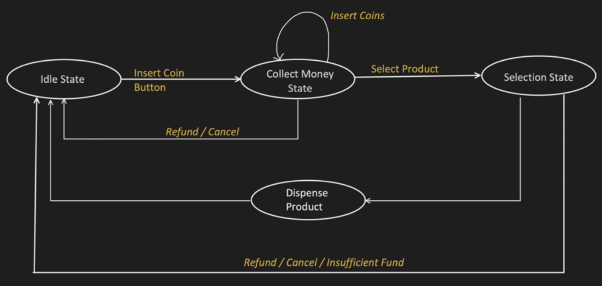

# Vending Machine

- [Requirements](#requirements)
- [Flow](#flow)
- [Entities](#entities)

## Requirements

- Vending Machine
    - Idle state
    - User inserts coin (Can be in loop for multiple coins)
    - User selects the product
    - Cancel choice/Collect Item
    - Collect change (If any)

## Flow

## Entities